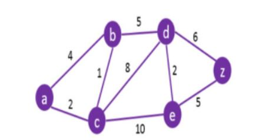

# Python Dijkstra's Algorithm

## This program will find the best cost from node a to all other nodes in the diagram

  
 ### STEP 1.
* Setup working environment, Header Notes/README.
I used Visual Studio Code and Python as my working environnment for this project. I then created a README file in my github account to display
and showcase my steps during the project. 

### STEP 2.
* The program will implement a class node where it will keep records of the nodes and the connections for each of the nodes

### STEP 3.
* We created a method to allow the creation of the graph and we are also able to display the tables with 
nodes/vertices and weights/cost for each of the nodes.

### STEP 4.
* We inserted the graph with all the details of the nodes and cost related in the graph we are trying to work with

### STEP 5. 
* Lastly, we implement the shortest path algorithm from a to all of the vertices

### Result
* We tested every defined node and printed the cost table for each of the nodes to validate the nodes were 
being represented correctly. Once that was validated, the shortest path algorithm was run against nodes to 
figure out what was the shorted path from node a to all other nodes.

### Final Comments:
* This implementation took quite a long time to figure out because a lot of the steps seemed to break as we build it, 
but once the pieces started to fall in place we was such a relief to see the code work and nice to see the algorithm work properly.
